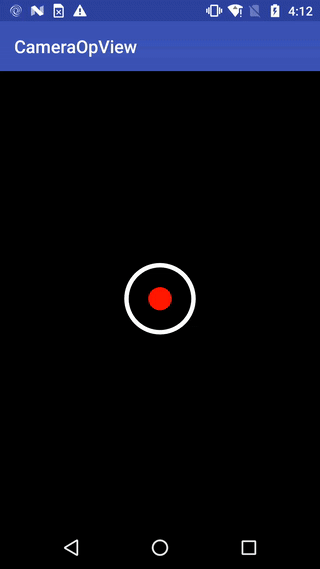

# CameraOpView
A view like Snapchat's home page round button.



## Usage
```Kotlin
        op.setCameraOpCallback(object : CameraOpView.CameraOpCallback {
            override fun onClick() {
                toast("onClick")
            }

            override fun onProgressStart() {
                this@MainActivity.vibrate(longArrayOf(0, 30))
                toast("onProgressStart")
            }

            override fun onProgressStop() {
                toast("onProgressStop")
            }

        })
```
```XML
<com.touge.cameraopview.CameraOpView
        android:id="@+id/op"
        android:layout_width="100dp"
        android:layout_height="100dp"
        app:pbTime="4"
        app:pbColor="#bb8888"
        android:layout_gravity="center_horizontal|bottom" />
```

## Setup
### Android Studio / Gradle
Add the following dependency in your root build.gradle at the end of repositories:
```Gradle
allprojects {
    repositories {
        //...
        maven { url = 'https://jitpack.io' }
    }
}
```
Add the dependency:
```Gradle
dependencies {
    compile 'com.github.tougee:cameraopview:0.0.1'
}
```

## License details

```
Copyright 2017 Touge

Licensed under the Apache License, Version 2.0 (the "License");
you may not use this file except in compliance with the License.
You may obtain a copy of the License at

	http://www.apache.org/licenses/LICENSE-2.0

Unless required by applicable law or agreed to in writing, software
distributed under the License is distributed on an "AS IS" BASIS,
WITHOUT WARRANTIES OR CONDITIONS OF ANY KIND, either express or implied.
See the License for the specific language governing permissions and
limitations under the License.
```
